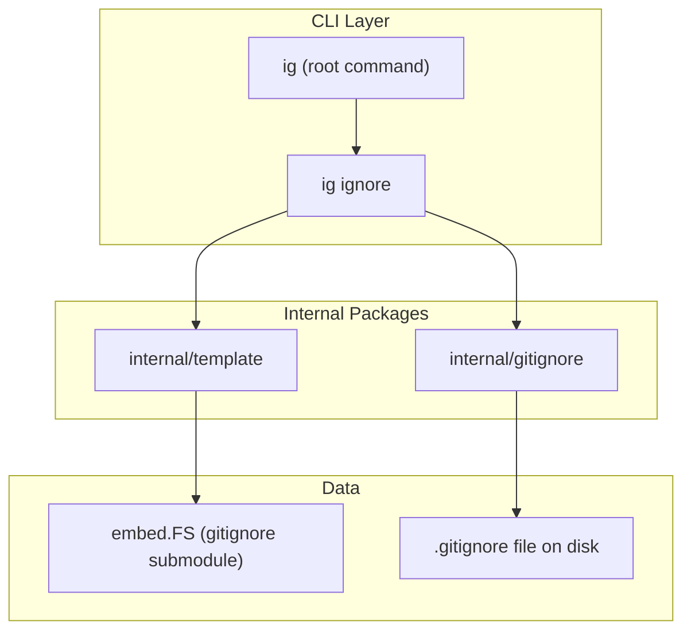
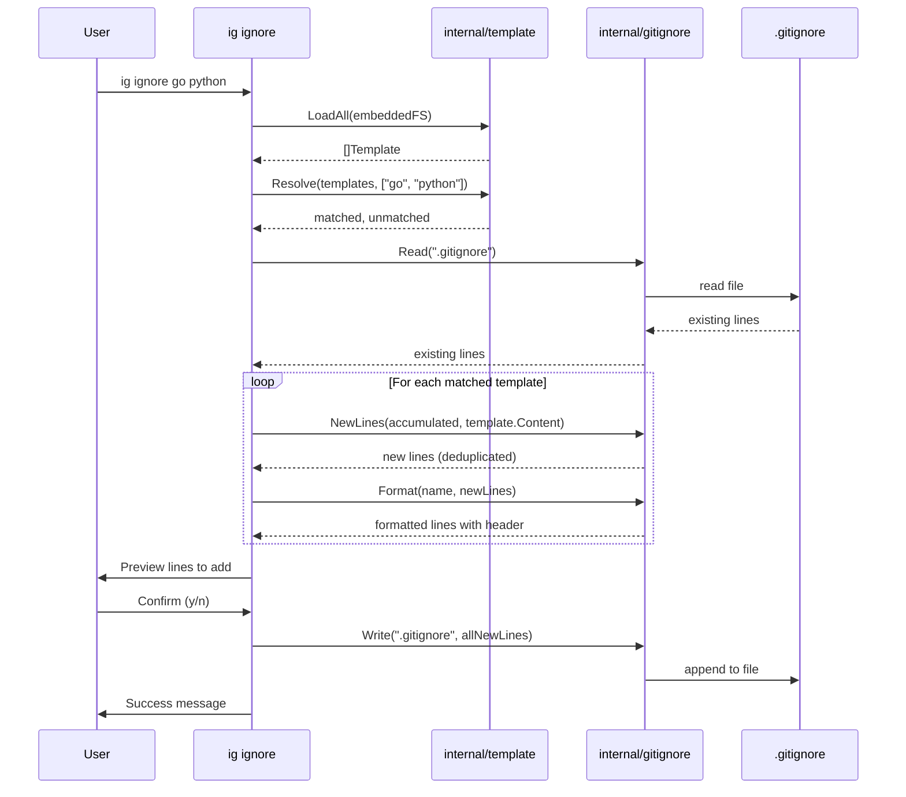

# Architecture

## System Overview

gitignorant is a single-binary CLI tool that generates `.gitignore` files by matching user-provided language/framework names against embedded templates from [github/gitignore](https://github.com/github/gitignore).



## Component Details

### CLI Layer (`cmd/`)

Built with [Cobra](https://github.com/spf13/cobra) and [Charmbracelet fang](https://charm.land/fang).

| Command | Usage | Description |
|---------|-------|-------------|
| `ig` | `ig` | Root command, prints help |
| `ig ignore` | `ig ignore go python node` | Generate/update `.gitignore` for given languages |

The `ignore` command (alias: `i`) accepts one or more language/framework names and orchestrates the full workflow: load templates, resolve matches, deduplicate against existing `.gitignore`, preview changes, and write.

### Template Package (`internal/template/`)

Responsible for loading and matching gitignore templates from the embedded filesystem.

**Types:**

- `Template` — holds a template's `Name` (e.g., "Go") and `Content` (the raw gitignore text)

**Functions:**

- `LoadAll(fs.FS)` — walks the embedded `gitignore/` directory in priority order: root, `Global/`, `community/`. Returns a flat list of templates.
- `Match([]Template, string)` — case-insensitive exact match, returns the first hit (respecting priority order).
- `Resolve([]Template, []string)` — splits user arguments into matched templates and unmatched names.

**Template Priority:**

```
1. gitignore/*.gitignore          (root — language-specific)
2. gitignore/Global/*.gitignore   (editor/OS patterns)
3. gitignore/community/**         (community-contributed)
```

When duplicate names exist across directories, the higher-priority version wins.

### Gitignore Package (`internal/gitignore/`)

Handles reading, diffing, formatting, and writing `.gitignore` files.

**Functions:**

- `Exists(path)` — checks if a `.gitignore` file exists
- `Read(path)` — reads an existing `.gitignore` into lines; returns `nil, nil` if missing
- `NewLines(existing, content)` — deduplicates template content against existing lines. Comments and blanks are always kept; pattern lines are compared with trimmed exact match. Returns `nil` if all patterns already present.
- `Format(name, lines)` — wraps lines with a header comment (`# Added by gitignorant: <name>`) and a blank separator
- `Write(path, lines)` — appends lines to the file (creates if missing), ensures trailing newline

## Data Flow



## Embedding Strategy

The `gitignore/` directory is a git submodule pointing at `github/gitignore`. At build time, Go's `//go:embed gitignore` directive in `embed.go` compiles the entire template tree into the binary. This means:

- No network requests at runtime
- Templates are versioned with the binary
- Updating templates requires updating the submodule and rebuilding

## Dependencies

| Dependency | Purpose |
|-----------|---------|
| `github.com/spf13/cobra` | CLI framework |
| `github.com/charmbracelet/fang` | Enhanced Cobra execution |
| `charm.land/lipgloss/v2` | Terminal styling (transitive) |
